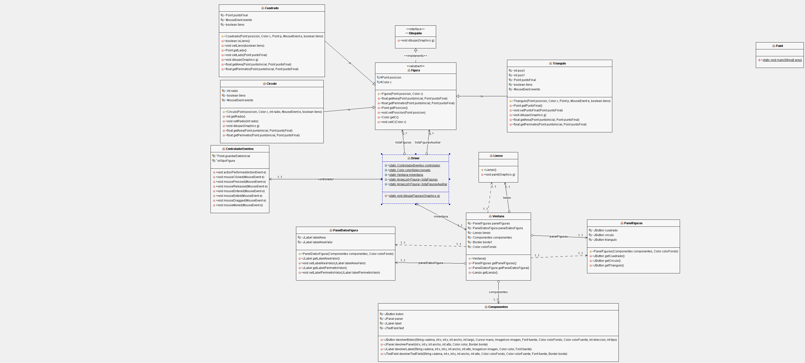

# FigurasGeometricas

## Integrantes

* Cristian Felipe Patiño Caceres - 20141020079
* Cristian David Santoyo Parra - 20141020077 
* Brian Giovanny Alfonso Rodriguez - 20151020600

## Informatica I

### Docente

* Alejandro Paolo Daza 

## Descripcion

El proyecto se crea como una actividad diagnostica para evaluar las habilidades de desarrollo y modelamiento ante un problema puntual.

### Ejercicio

Ejercicio de modelado e implementación del caso practico de aplicación que permite dibujar figuras geométricas básicas en una interfaz de usuario y calcula el área y el perímetro de cada figura. la entrega debe realizarse mediante un repositorio al estilo git.

## Solucion 

La implementacion es creada en Java utilizando las propiedades que proporciona **Graphics** ademas de los eventos del Mouse **MouseListener** y **MouseMotionListener** los cuales nos permiten dibujar en tiempo real las figuras basicas (Rectangulo, Circulo, Cuadrado) y obtener su Area y Perimetro mediante el movimiento del usuario.

## Demostracion 

## Modelo

